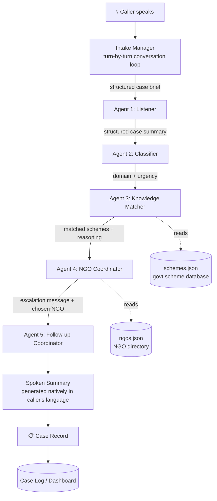

# Sahayak 🤝 সহায়ক

### A voice-first, multi-agent helpline that connects rural Indian callers to government health & finance schemes — and to the NGOs who can help them apply.

> Built for the IIT Kharagpur Agentic AI Hackathon — Architecture & Implementation Submission

## 🔗 Live Demo

**[https://huggingface.co/spaces/Ishwaryashriiiiiiiii/Sahayak](https://huggingface.co/spaces/Ishwaryashriiiiiiiii/Sahayak)**

Open the link, click **Start Call**, and talk (or type) as a caller describing a problem — the bot will ask follow-up questions, run the full agent pipeline, and speak a summary back.


---

## Table of Contents

1. [The Problem](#the-problem)
2. [A Real Scenario](#a-real-scenario)
3. [Why This Is an Agent Problem, Not a Chatbot Problem](#why-this-is-an-agent-problem-not-a-chatbot-problem)
4. [How a Call Actually Works](#how-a-call-actually-works)
5. [Architecture](#architecture)
6. [The Dashboard](#the-dashboard)
7. [Tech Stack](#tech-stack)
8. [Project Structure](#project-structure)
9. [Setup](#setup)
10. [Running Locally](#running-locally)
11. [Deploying to Hugging Face Spaces](#deploying-to-hugging-face-spaces)
12. [What's Real vs. Simulated](#whats-real-vs-simulated)
13. [Known Limitations](#known-limitations)
14. [Roadmap to Production](#roadmap-to-production)
15. [Author](#author)

---

## The Problem

India runs hundreds of government welfare schemes covering healthcare, maternity benefits, disability pensions, farmer support, and education. Most of them genuinely work — **if you know they exist, know you qualify, and know how to apply.**

For a large share of rural India, none of those three conditions hold:

- **Discovery is broken.** Scheme information lives on websites and PDFs written in bureaucratic English, assuming literacy and internet access that often isn't there.
- **Eligibility is confusing.** A person doesn't know whether their specific situation (a pregnant wife, a lost crop, a disabled parent) qualifies them for a specific scheme.
- **Follow-through is the hardest part.** Even when someone learns about a scheme, navigating the application — collecting documents, visiting the right office, knowing who to call when stuck — is where most people give up.

Existing digital solutions (apps, websites, SMS campaigns) assume smartphone literacy and reading ability that a large rural population does not have. **The one piece of technology that is almost universally usable is a basic phone call.**

## A Real Scenario

> Ramesh is a farmer in a village near Kharagpur, West Bengal. His wife is seven months pregnant. The family has little savings, and this season's crop was damaged by unseasonal rain. Ramesh doesn't know that a maternity scheme could cover his wife's delivery costs, that a farmer welfare scheme could offset his crop loss, or that an NGO nearby exists specifically to help people in his situation file these claims. He has a basic phone. He does not read English, and would not know which government office to call even if he wanted to.

This is the person Sahayak is built for. He calls one number. He talks naturally, the way he'd talk to a person — in Hindi, in his own words, answering questions one at a time. The system listens, understands, and figures out the rest.

## Why This Is an Agent Problem, Not a Chatbot Problem

A chatbot answers what you ask it and stops. That's insufficient here for two reasons:

1. **The reasoning is multi-step and domain-spanning.** A rambling description ("my wife is pregnant and we lost a crop") needs to be structured, classified across health *and* finance, matched against eligibility rules in a scheme database, routed to the right local organization, and turned into a specific, actionable next step — five distinct kinds of reasoning, each better handled by a specialist than by one prompt trying to do everything.
2. **The system has to act, not just respond.** It doesn't just tell Ramesh "some schemes might help" — it identifies *which* schemes, drafts an escalation message for a real NGO, and sets up a follow-up so Ramesh isn't forgotten after one call.

That's what makes this a **multi-agent system** rather than a single LLM call with a system prompt.

## How a Call Actually Works

A call is a guided, turn-by-turn conversation — not a single recording dumped into a pipeline:

1. **Greeting** — the bot introduces itself and invites the caller to describe what's going on, in their own language (English or Hindi).
2. **Intake Manager** (see `intake_manager.py`) — a lightweight LLM-driven loop (deliberately *not* a CrewAI agent — see the architecture note below) asks for name, location, and the caller's situation one turn at a time, extracting whatever fields are present in each reply even if the caller answers out of order, volunteers extra detail, or declines to elaborate further. It asks targeted follow-up questions (age, family status, occupation, etc.) only when something eligibility-relevant is still missing, and stops once it has enough to proceed (hard-capped at 6 turns as a safety net).
3. Once intake is complete, the structured case is handed to the **5-agent CrewAI pipeline** (below), which runs once per call.
4. The pipeline's output is turned into a **spoken summary** — generated natively in the caller's language (not translated after the fact) — and read back to the caller via text-to-speech.

## Architecture



All five agents run **sequentially** via CrewAI's `Process.sequential`, with each task's output passed as context into the next. The Knowledge Matcher and NGO Coordinator tasks use `output_pydantic` for structured output (`MatcherOutput`, `NGOOutput` in `tasks/definitions.py`), so the UI reads real scheme/NGO fields directly instead of regex-scraping prose.

| # | Agent | Job | Reads | Produces |
|---|-------|-----|-------|----------|
| — | **Intake Manager** | Asks for name/location/situation turn by turn, extracting fields from however the caller answers | Conversation so far | Structured case brief |
| 1 | **Listener** | Normalizes the completed intake into a clean case summary | Case brief | `person_situation`, `stated_need`, `mentioned_details` |
| 2 | **Classifier** | Tags the case by domain and urgency | Listener output | `domain` (health/finance/both), `urgency`, `urgency_reason` |
| 3 | **Knowledge Matcher** | Matches the case against the scheme database with eligibility reasoning | Listener + Classifier output, `schemes.json` | Up to 3 matched schemes, each with `why_match`, `documents_needed`, `confidence_score`, `reasoning_path` |
| 4 | **NGO Coordinator** | Picks the right NGO and drafts an escalation message | All prior outputs, `ngos.json` | Chosen NGO + escalation message |
| 5 | **Follow-up Coordinator** | Plans the check-in so the case doesn't go cold | All prior outputs | Follow-up message (native language) + recommended timing |

**Why the Intake Manager isn't a CrewAI agent:** CrewAI's `Crew`/`Task` abstraction is built for one-shot sequential pipelines, not a stateful, turn-by-turn loop that needs to persist partial state across Streamlit reruns and decide what to ask next. Re-invoking a full `Crew.kickoff()` every conversational turn just to ask one question would be slow and architecturally awkward. Instead, `intake_manager.py` makes one direct `llm.call()` per turn, reusing the same LLM object the 5-agent pipeline uses — and only hands off to the existing Listener task once intake is complete. This keeps the existing 4 downstream tasks completely unchanged.

## The Dashboard

The third tab ("How It Works") is a real operator dashboard, not a static explainer page — a sidebar switches between four views, all computed from the actual case log (`data/cases.json`), never fabricated:

- **Dashboard** — KPI cards (total calls, language split, NGOs engaged) plus a real "Calls Over Time" line chart and "Top Schemes Matched" bar chart
- **NGOs** — the full NGO directory with a real "times engaged" count per NGO
- **Schemes** — the full scheme catalog with a real "times matched" count per scheme
- **Settings** — the actual configured values from `config/settings.py` and the environment (STT/TTS models, LLM model, rate limits) — read-only, since there's no settings backend to persist edits to

## Tech Stack

| Layer | Technology | Why |
|---|---|---|
| Agent orchestration | **CrewAI** | Sequential multi-agent pipelines with built-in context passing between tasks |
| LLM reasoning | **OpenRouter → Llama 3.3 70B Instruct** | One model handles all 5 agents plus the Intake Manager's turn-by-turn extraction |
| Structured output | **Pydantic + CrewAI `output_pydantic`** + **instructor** | Reliable structured fields instead of regex-scraping LLM prose |
| Speech-to-text | **Groq Whisper** (`whisper-large-v3-turbo`) | Same multilingual model for English and Hindi input, just a different language hint |
| Text-to-speech (English) | **Groq Orpheus TTS** | Fast, low-latency English voice synthesis |
| Text-to-speech (Hindi) | **Sarvam AI** (`bulbul:v2`) | Purpose-built for Indian languages; falls back to **gTTS** automatically if no Sarvam key is configured or the call fails |
| Demo interface | **Streamlit** | Tabbed UI with a real mic input widget (`st.audio_input`), styled as a live phone call rather than a generic dashboard |
| Data layer | **JSON files** (`schemes.json`, `ngos.json`, `cases.json`) | Zero-setup, transparent, easy to swap for a real DB later |
| Config | **python-dotenv** | Keeps API keys out of source control |

## Project Structure

```
sahayak_package/
├── app.py                   # Streamlit UI: live call screen, case log, dashboard
├── intake_manager.py        # Turn-by-turn conversation manager (not a CrewAI agent - see Architecture)
├── crew_runner.py           # Orchestrates the 5-agent CrewAI pipeline + spoken summary generation
├── voice_tools.py           # Groq Whisper transcription + Groq Orpheus / Sarvam / gTTS speech synthesis
├── tools_data.py            # Loads/saves schemes, NGOs, and case records (JSON-backed)
├── agents/
│   └── definitions.py       # All 5 CrewAI Agent definitions + the shared LLM object
├── tasks/
│   └── definitions.py       # All 5 CrewAI Task definitions, incl. Pydantic output models
├── config/
│   └── settings.py          # Absolute paths + all API/model configuration (env-driven)
├── data/
│   ├── schemes.json         # 12 government health & finance schemes (real central + WB state schemes)
│   ├── ngos.json             # 5 illustrative NGOs for the Kharagpur district demo
│   └── cases.json            # Runtime-generated case log (gitignored)
├── assets/
│   └── hold_tune.wav         # Short instrumental hold chime (synthesized, royalty-free)
├── requirements.txt
├── .env.example
└── .gitignore
```

## Setup

```bash
# 1. Clone
git clone <your-repo-url>
cd sahayak_package

# 2. Virtual environment
python -m venv venv
source venv/bin/activate        # Windows: venv\Scripts\activate

# 3. Install dependencies
pip install -r requirements.txt

# 4. Configure your API keys
cp .env.example .env
# then edit .env and fill in:
#   GROQ_API_KEY        - https://console.groq.com/keys (Whisper STT + English TTS)
#   OPENROUTER_API_KEY  - https://openrouter.ai/keys (all agent/LLM reasoning)
#   SARVAM_API_KEY      - https://www.sarvam.ai (Hindi TTS; optional - falls back to gTTS if blank)
```

## Running Locally

```bash
streamlit run app.py
```

This opens a browser tab with three sections: a live call screen (phone panel + live agent pipeline strip), a case log, and the dashboard described above.

**Command-line (single case, for quick testing, no UI):**
```bash
python crew_runner.py
```
Runs one canned sample case through the full pipeline and prints every stage's output to the terminal.

## Deploying to Hugging Face Spaces

This repo is already configured for Hugging Face Spaces (see the YAML frontmatter at the top of this file). To deploy your own copy:

1. Create a Space at [huggingface.co/new-space](https://huggingface.co/new-space) with **SDK: Streamlit**.
2. Get a **write** token from [huggingface.co/settings/tokens](https://huggingface.co/settings/tokens).
3. Push this repo to it:
   ```bash
   huggingface-cli login --token YOUR_TOKEN
   git remote add hf-space https://huggingface.co/spaces/YOUR_USERNAME/YOUR_SPACE
   git push hf-space master:main --force
   ```
4. On the Space page → **Settings → Variables and secrets**, add `GROQ_API_KEY`, `OPENROUTER_API_KEY`, and `SARVAM_API_KEY` as **Secrets**.
5. The Space rebuilds automatically (~1-2 min) and is live at `https://huggingface.co/spaces/YOUR_USERNAME/YOUR_SPACE`.

**Note:** HF Spaces rejects plain-git binary files (e.g. `assets/hold_tune.wav`) unless tracked with Git LFS. The deployed Space omits this file — `voice_tools.py`'s hold-tune playback already fails gracefully (try/except) if it's missing, so nothing breaks.

## What's Real vs. Simulated

**✅ Fully real:**
- The multi-turn intake conversation, driven live by the LLM turn-by-turn
- All 5 agents run on live CrewAI orchestration with real LLM calls at every stage
- Scheme-matching reasoning is genuine — the Knowledge Matcher reasons over actual eligibility criteria from `schemes.json`, no keyword matching
- The NGO escalation message and follow-up plan are generated fresh per case
- **Hindi speech input** — Groq Whisper transcribes Hindi the same way as English, just with a language hint
- **Native Hindi generation** — intake questions, the spoken summary, and the follow-up message are composed directly in Hindi by the LLM, never translated after the fact from an English draft
- The case log and dashboard reflect actual pipeline runs, computed live from `data/cases.json`

**🔶 Simulated or partial, with a clear path to real:**
- **Phone telephony** — voice is captured via the browser's microphone (`st.audio_input`), not an actual phone call. Production would put Twilio in front of the same Whisper transcription call.
- **NGO directory** — the 5 NGOs in `ngos.json` are illustrative/fictional for the Kharagpur district demo.
- **NGO notification** — the escalation message is generated and shown in the UI, not actually dispatched. Production would send it via Twilio SMS/voice.
- **Multi-day follow-up** — a follow-up *plan* (message + recommended timing) is produced per call; actually re-contacting the caller days later would need a scheduler wired to the same agent.
- **Hindi TTS quality** — falls back to gTTS (more robotic) if no `SARVAM_API_KEY` is configured.

## Known Limitations

- **OpenRouter free-tier throttling.** The shared LLM object has an explicit request timeout (see `agents/definitions.py`) because the free-tier key has been observed to silently stall a call for minutes under load rather than erroring. If a turn or pipeline stage seems stuck, this is most likely why — it's an infrastructure constraint, not a code bug. A paid OpenRouter tier removes this risk.
- **Scheme/NGO usage stats are best-effort.** The dashboard's "times matched"/"times engaged" counts are derived by text-matching scheme/NGO names inside the logged prose output (since those are stored as text, not structured fields, per case) — real data, but approximate.

## Roadmap to Production

1. Replace browser-mic input with real telephony (Twilio) + regional-language speech-to-text
2. Replace the fictional NGO directory with a verified, consented partner network
3. Add real message dispatch (Twilio SMS/voice) for NGO escalation and caller follow-up
4. Add a scheduler so the Follow-up Coordinator's plan actually triggers a real callback days later
5. Expand the scheme database beyond the 12 seeded here to the full set of central + state schemes
6. Add a feedback loop: track which schemes/NGOs actually resulted in successful applications

## Author

**Ishwarya Mohan** (Metallurgical & Materials Engineering, IIT Kharagpur)
