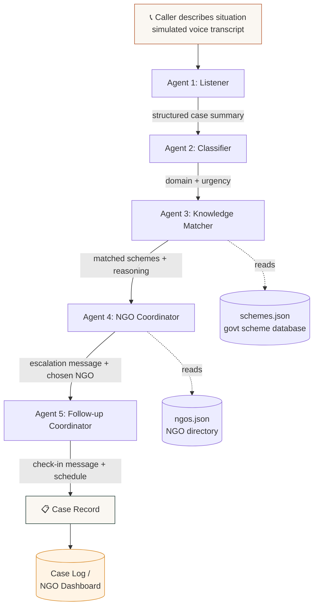

# Sahayak 🤝
### A multi-agent helpline that connects rural callers to government health & finance schemes — and to the NGOs who can actually help them apply.

> Built for the IIT Kharagpur Agentic AI Hackathon — Architecture & Implementation Submission

---


---

## Table of Contents

1. [The Problem](#the-problem)
2. [A Real Scenario](#a-real-scenario)
3. [Why This Is an Agent Problem, Not a Chatbot Problem](#why-this-is-an-agent-problem-not-a-chatbot-problem)
4. [Architecture](#architecture)
5. [The Five Agents](#the-five-agents)
6. [Tech Stack](#tech-stack)
7. [Project Structure](#project-structure)
8. [Setup](#setup)
9. [Running the Demo](#running-the-demo)
10. [What's Real vs. Simulated in This Prototype](#whats-real-vs-simulated-in-this-prototype)
11. [Roadmap to Production](#roadmap-to-production)
12. [Authors](#authors)

---

## The Problem

India runs hundreds of government welfare schemes covering healthcare, maternity benefits, disability pensions, farmer support, and education. Most of them genuinely work — **if you know they exist, know you qualify, and know how to apply.**

For a large share of rural India, none of those three conditions hold:

- **Discovery is broken.** Scheme information lives on websites and PDFs written in bureaucratic English, assuming literacy and internet access that often isn't there.
- **Eligibility is confusing.** A person doesn't know whether their specific situation (a pregnant wife, a lost crop, a disabled parent) qualifies them for a specific scheme.
- **Follow-through is the hardest part.** Even when someone learns about a scheme, navigating the application — collecting documents, visiting the right office, knowing who to call when stuck — is where most people give up.

Existing digital solutions (apps, websites, SMS campaigns) assume smartphone literacy and reading ability that a large rural population does not have. **The one piece of technology that is almost universally usable is a basic phone call.**

## A Real Scenario

> Ramesh is a farmer in a village near Kharagpur, West Bengal. His wife is seven months pregnant. The family has little savings, and this season's crop was damaged by unseasonal rain. Ramesh doesn't know that a maternity scheme could cover his wife's delivery costs, that a farmer welfare scheme could offset his crop loss, or that an NGO twenty kilometers away exists specifically to help people in his situation file these claims. He has a basic phone. He does not have a smartphone, does not read English, and would not know which government office to call even if he wanted to.

This is the person Sahayak is built for. He calls one number. He explains his situation in his own words. The system figures out the rest.

## Why This Is an Agent Problem, Not a Chatbot Problem

A chatbot answers what you ask it and stops. That's insufficient here for two reasons:

1. **The reasoning is multi-step and domain-spanning.** A single sentence ("my wife is pregnant and we lost a crop") needs to be parsed, classified across health *and* finance, matched against eligibility rules in a scheme database, routed to the right local organization, and turned into a specific, actionable next step — five distinct kinds of reasoning, each better handled by a specialist than by one prompt trying to do everything.

2. **The system has to act, not just respond.** It doesn't just tell Ramesh "some schemes might help" — it identifies *which* schemes, drafts an actual escalation to a real NGO with the context that NGO needs to act, and sets up a follow-up so Ramesh isn't forgotten after one call. That's initiative and persistence, not just Q&A.

That's what makes this a **multi-agent system** rather than a single LLM call with a system prompt.

## Architecture



All five agents run **sequentially** via CrewAI's `Process.sequential`, with each task's output passed as context into the next — so the Classifier sees the Listener's structured summary, the Knowledge Matcher sees both prior outputs, and so on. No agent re-derives what a previous agent already established.

## The Five Agents

| # | Agent | Job | Reads | Produces |
|---|-------|-----|-------|----------|
| 1 | **Listener** | Structures the raw, possibly rambling transcript into a clean case summary | Raw transcript | `person_situation`, `stated_need`, `mentioned_details` |
| 2 | **Classifier** | Tags the case by domain and urgency | Listener output | `domain` (health/finance/both), `urgency`, `urgency_reason` |
| 3 | **Knowledge Matcher** | Matches the case against the scheme database with eligibility reasoning | Listener + Classifier output, `schemes.json` | Up to 3 matched schemes with `why_match` and `documents_needed` |
| 4 | **NGO Coordinator** | Picks the right NGO and drafts an escalation message | All prior outputs, `ngos.json` | Chosen NGO + a ready-to-send escalation message |
| 5 | **Follow-up Coordinator** | Plans the check-in so the case doesn't go cold | All prior outputs | A warm follow-up message + recommended follow-up timing |

Each agent has **one narrow responsibility** deliberately — this is what makes the system debuggable and lets each agent's prompt stay focused instead of trying to do five jobs in one pass.

## Tech Stack

| Layer | Technology | Why |
|---|---|---|
| Agent orchestration | **CrewAI** | Sequential multi-agent pipelines with built-in context passing between tasks |
| LLM routing | **LiteLLM** | CrewAI's provider abstraction layer for non-OpenAI models |
| Speech-to-text | **Groq Whisper (`whisper-large-v3-turbo`)** | Same multilingual model for English and Hindi input, just a different language hint |
| Text-to-speech (English) | **Groq Orpheus TTS** (`canopylabs/orpheus-v1-english`) | Fast, low-latency English voice synthesis |
| Text-to-speech (Hindi) | **gTTS** | Free fallback since Groq has no Hindi voice yet |
| Translation | Same LLM used by the agents, via a plain prompt (`crew_runner.translate_text`) | No extra translation dependency |
| Demo interface | **Streamlit** | Fast to build, clean tabbed UI with a real mic input widget (`st.audio_input`) |
| Data layer | **JSON files** (`schemes.json`, `ngos.json`, `cases.json`) | Zero-setup, transparent, easy to swap for a real DB post-hackathon |
| Config | **python-dotenv** | Keeps API keys out of source control |

## Project Structure

```
sahayak/
├── app.py                      # Streamlit demo UI (3 tabs: call simulator, case log, architecture)
├── crew_runner.py              # Orchestrates the 5-agent CrewAI pipeline end-to-end + Hindi translation step
├── voice_tools.py               # Groq Whisper transcription + Groq Orpheus/gTTS speech synthesis
├── tools_data.py                # Loads/saves schemes, NGOs, and case records (JSON-backed)
├── agents/
│   └── definitions.py          # All 5 CrewAI Agent definitions (role, goal, backstory, LLM)
├── tasks/
│   └── definitions.py          # All 5 CrewAI Task definitions (description, expected_output, context)
├── config/
│   └── settings.py             # Absolute paths + Groq LLM config (env-driven)
├── data/
│   ├── schemes.json            # 12 government health & finance schemes (real central + WB state schemes)
│   └── ngos.json                # 5 illustrative NGOs for the Kharagpur district demo
├── requirements.txt
├── .env.example
└── .gitignore
```

## Setup

```bash
# 1. Clone
git clone <your-repo-url>
cd sahayak

# 2. Virtual environment
python -m venv venv
source venv/bin/activate        # Windows: venv\Scripts\activate

# 3. Install dependencies
pip install -r requirements.txt

# 4. Configure your Groq API key
cp .env.example .env
# then edit .env and paste your key from console.groq.com
```

## Running the Demo

**Streamlit UI (recommended for judging/demo):**
```bash
streamlit run app.py
```
This opens a browser tab with three sections: a call simulator (type what the caller says, run the full 5-agent pipeline, see every stage's output), a case log / NGO dashboard, and an architecture explainer.

**Command-line (single case, for quick testing):**
```bash
python crew_runner.py
```
Runs one hardcoded sample case (Ramesh's scenario) through all five agents and prints every stage's output to the terminal.

## What's Real vs. Simulated in This Prototype

We'd rather be upfront about this than have it surface awkwardly during judging.

**✅ Fully real and working:**
- All 5 agents run on live CrewAI orchestration with real LLM calls at every stage
- The scheme-matching reasoning is genuine — the Knowledge Matcher agent reasons over actual eligibility criteria, it doesn't use keyword matching
- The NGO escalation message and follow-up plan are generated fresh per case, not templated
- The case log and dashboard reflect actual pipeline runs
- **Hindi speech input** — recorded audio is transcribed by Groq Whisper (`whisper-large-v3-turbo`) the same way for English and Hindi; there is no separate "Hindi mode" model, just a language hint passed to the same STT call
- **Hindi text translation** — the transcript summary, matched-schemes summary, and follow-up message are translated to Hindi by a plain prompt to the same LLM that runs the agents (`crew_runner.translate_text`), not a separate translation API or library

**🔶 Simulated or partial in this prototype, with a clear path to real:**
- **Hindi speech output is not on the same engine as English.** Groq's hosted TTS (Orpheus) only ships English and Arabic voices — there is no Groq Hindi voice yet. So English follow-up audio is synthesized by Groq Orpheus, while Hindi follow-up audio falls back to gTTS (Google Text-to-Speech), a different, free engine. This is a real functional gap, not a demo simplification — we're flagging it rather than implying one unified voice stack handles both languages end-to-end.
- **Phone telephony** — voice is captured via the browser's microphone (`st.audio_input`), not an actual phone call. A production version would put Twilio/Exotel in front of the same Whisper transcription call.
- **NGO directory** — the 5 NGOs in `ngos.json` are illustrative/fictional for the Kharagpur district demo, since compiling and verifying a real, consented directory of NGO contacts was out of scope for a hackathon timeline. The escalation logic itself does not change when this is swapped for real, verified contacts.
- **Message dispatch** — escalation and follow-up messages are generated and logged, not actually sent via SMS/email/WhatsApp in this prototype.
- **Multi-day follow-up** — the Follow-up Coordinator produces a *plan* (message + recommended timing) in a single pipeline run; actually re-contacting the caller days later would need a scheduler (e.g. a cron job or Twilio's scheduled messaging) wired to the same agent.

The reason for drawing this line here: most of what we simulated is integration and infrastructure work (telephony, messaging, scheduling, partner onboarding), not reasoning work. The one real functional gap — Hindi voice output running on a different engine than English — is a genuine limitation of Groq's current TTS offering, not something we chose to simplify.

## Roadmap to Production

1. Replace the text-box input with real telephony (Twilio/Exotel) + regional-language speech-to-text (Bhashini is purpose-built for Indian languages and worth evaluating first)
2. Replace the fictional NGO directory with a verified, consented partner network, onboarded district by district
3. Add real message dispatch (SMS/WhatsApp Business API) for NGO escalation and caller follow-up
4. Add a scheduler so the Follow-up Coordinator's plan actually triggers a real callback days later
5. Expand the scheme database beyond the 12 seeded here to the full set of central + West Bengal state schemes, ideally sourced from an official API if one becomes available
6. Add a feedback loop: track which schemes/NGOs actually resulted in successful applications, and feed that back into the Knowledge Matcher's reasoning over time

## Authors

 **Ishwarya Mohan** (Metallurgical & Materials Engineering, IIT Kharagpur)

